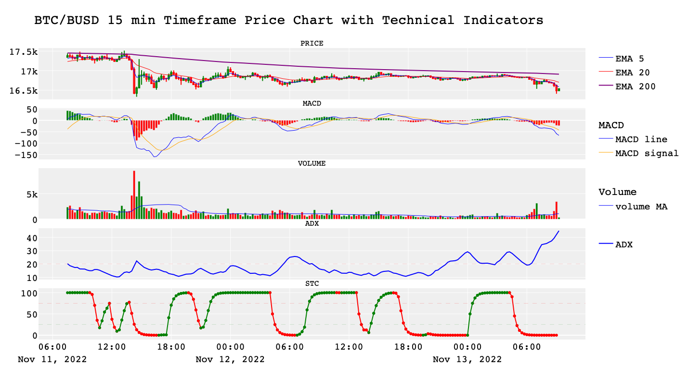

## Algorithmic Trading Bot

#### Task Formulation

Algorithmic trading uses a computer program that follows a defined set of instructions (an algorithm) to place a trade. The trade, in theory, can generate profits at a speed and frequency that is impossible for a human trader.

The defined sets of instructions are based on timing, price, quantity, or any mathematical model. Apart from profit opportunities for the trader, algo-trading renders markets more liquid and trading more systematic by ruling out the impact of human emotions on trading activities.

So, I wanted to create a simple python bot that trades crypto currency automatically based on the technical analysis algorithm.

This bot trades 5 crypto pairs in 15 min timeframe on Binance cryptocurrency exchange.

#### Techniques

Here I used:

- Trading technical indicators:
  - [Exponential Moving Average (EMA)](https://www.investopedia.com/terms/e/ema.asp)
  - [Schaff Trend Cycle (STC)](https://www.investopedia.com/articles/forex/10/schaff-trend-cycle-indicator.asp)
  - [Average Directional Index (ADX)](https://www.investopedia.com/terms/a/adx.asp)

- Visualizations (Plotly and Seaborn):
  - Candlechart
  - Technical Indicators: EMA, STC, ADX
  - Lineplot for results

- Python:
  - Functions
  - Threading
  - API
  - Output to file

#### Files Description

- [stc_ema_adx](stc_ema_adx.py) - main python script with strategy, functions, API connections
- [run_trading_strategy_1](run_trading_strategy_1.py) - a python script to run the bot (with threading)
- [plot_indicators](plot_indicators.py) - a python script to plot the chart with indicators
- [plot_results](plot_results.py) - a python script to plot the results of the trading
- [trading_strategy_1](trading_strategy_1.csv) - a csv file with trade results
- [api_keys](api_keys.py) - a python script with api keys to connect to Binance Exchange (not relevant)

ATTENTION: This project is for educational purposes only! Do not try this bot on real money without backtesting. 

