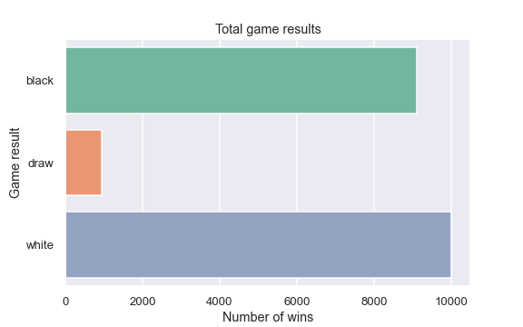

## Chess Games Results Exploratory Analysis

#### Task Formulation

In this project I explored the __'First-move advantage in chess'__ thesis.

There is a general consensus among chess players and theorists that the player who makes the first move (White) has an inherent advantage.
So, I tried to check this statement statistically using `R` based on the dataset from [Kaggle](https://www.kaggle.com/datasets/datasnaek/chess).

- Statistics
- Visualization
- Proving thesis
- Data manipulation

#### You can check [pdf](chess_analysis.pdf) version, [Jupyter Notebook](chess_analysis.ipynb) and [html](chess_analysis.html) version of this project.

