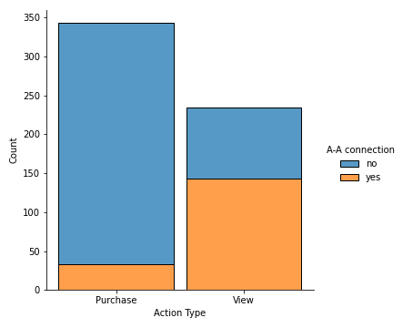

## Product Data Analysis. Related Products

#### Task Formulation

Some categories in the product range are related. For example, phone accessories are useless without the phones themselves. Therefore, for promotions, mailings, and recommendations, it is important to know the existence of this kind dependencies between categories and in categories with themselves (if users access the category repeatedly). What are the dependencies, and between which categories, if we consider only purchases? How does the user behave when browsing products? How are purchases fundamentally different from views, and why?
Find insights, with explanations. Graphics are welcome.

 - Python (pandas, numpy)
 - Visualizing data (matplotlib, seaborn)
 - Data Analysis

### You can check [pdf](data/related_products.pdf) version and a [Jupyter Notebook](related_products.ipynb) with full analysis and conclusion.

