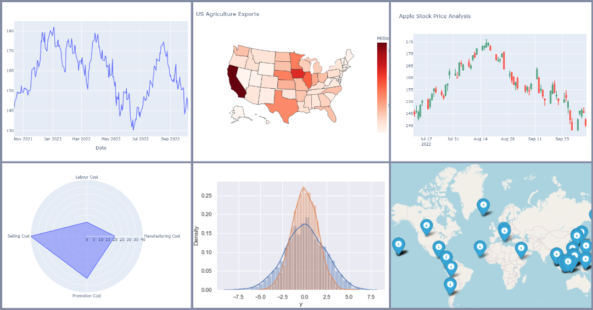

# Data Analysis Portfolio Projects

My Exploratory Data Analysis (EDA), Product Analysis and Statistical projects are stored here:

1. [Chess Games Results Exploratory Analysis](https://github.com/ZhuuukDS/Data-Analysis/tree/main/Chess%20Games%20Results%20Exploratory%20Analysis)
2. [Product Analysis. Related Products](https://github.com/ZhuuukDS/Data-Analysis/tree/main/Product%20Analysis.%20Related%20Products)
3. [Shooting Cases Statistical Analysis](https://github.com/ZhuuukDS/Data-Analysis/tree/main/Shooting%20Cases%20Statistical%20Analysis)
4. [Tennis Points Distribution Analysis](https://github.com/ZhuuukDS/Data-Analysis/tree/main/Tennis%20Points%20Distribution%20Analysis)

