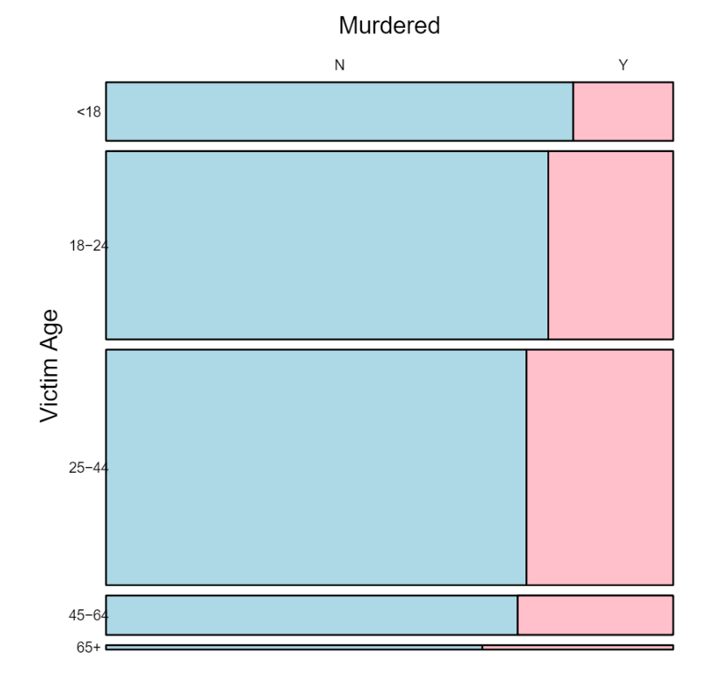

## NYPD shooting cases data statistical analysis

#### Overview
This project is to show the statistical analysis of the shooting cases based on NYPD data collected from 2006 to 2021. 
I used `R` and the following libraries for data cleaning, analysis and visualization are needed:
 - ggplot2
 - dplyr
 - lubridate
 - tidyr
 - vcd
 
 #### Please check out [pdf](CU_shooting_project.pdf), [html](CU_shooting_project.html) and [rmd](CU_shooting_project.Rmd) versions of this project.
