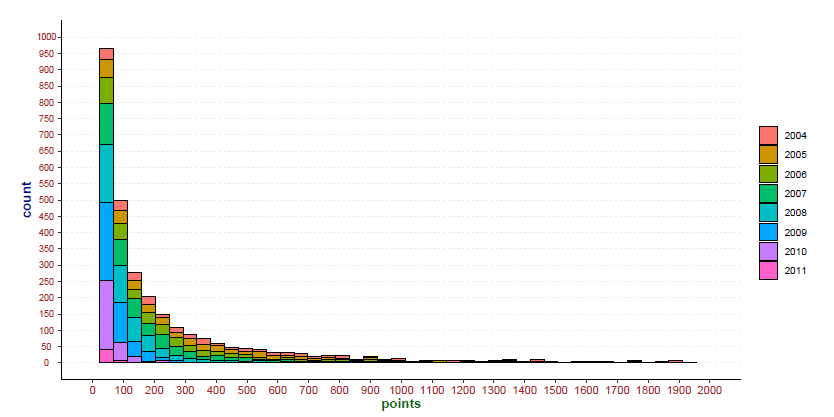

## Tennis Points Distribution Analysis

#### Overview
This study is aimed at analysing the distribution of 'Russian Tennis Tour' points among russian female tennis players under the age of 16. 
In this study, I tried to determine the influence of various factors on the number of rating points and identify dependencies and patterns. 
I used the `R` language (the 4.2.0 version) for data analysis.  
The main statistics and metrics used in this analysis: __mean, median, variance, standard deviation, 1st and 3rd quartiles, confidence levels, p-values__.  
To compare groups of observations, __one-factor__ and __two-factor__ methods analysis of variance was used (__ANOVA__).

The following libraries are will be used:
- dplyr
- tidyr
- ggplot2
- gplots
- readxl
 
 #### Please check out [pdf](RTT_project.pdf), [html](RTT_project.html) and [rmd](RTT_project.Rmd) versions of this project.
